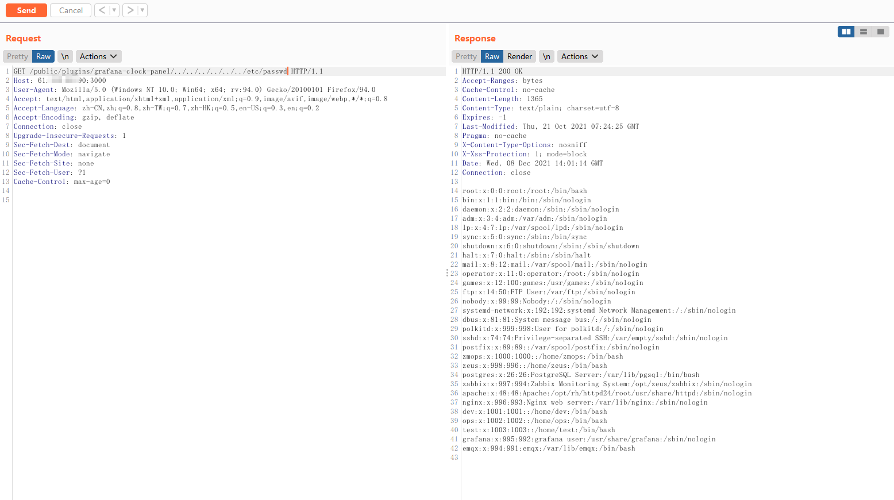
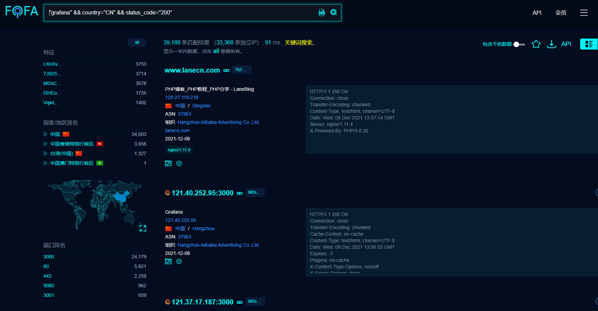
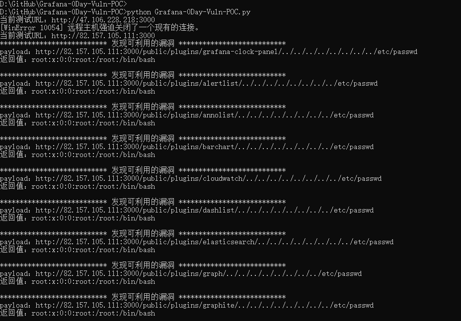
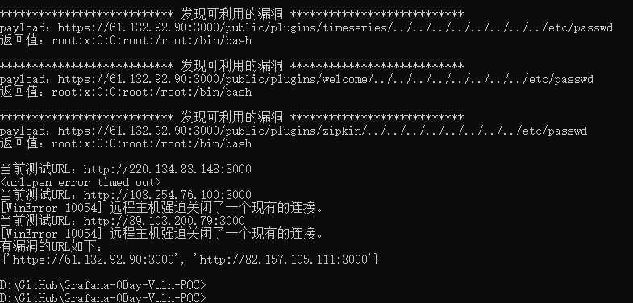

## Grafana V8.0+版本存在未授权任意文件读取 0Day漏洞 - POC

### 1 漏洞信息

#### 1.1 基本信息

- 漏洞厂商：Grafana
- 厂商官网：[https://grafana.com/](https://grafana.com/)

#### 1.2 漏洞描述

- Grafana是一个跨平台、开源的数据可视化网络应用程序平台。用户配置连接的数据源之后，Grafana可以在网络浏览器里显示数据图表和警告。目前Grafana 存在未授权任意文件读取漏洞，攻击者在未经身份验证的情况下可通过该漏洞读取主机上的任意文件。
- 漏洞评级：高危

#### 1.3 受影响版本

- 受影响版本：V8.0+

### 1.4 修复建议

- 建议及时通过网络/安全设备设置黑白名单策略，非必要不暴露在外网。
- 等待官方补丁进行升级



### 2 FOFA查询

- 使用fofa可以查询到grafana的站点，查询语法如下

```
"grafana" && country="CN" && status_code="200"
```



### 3 POC使用方法

1. 将FOFA获取到的URL导入 `url_list_file.txt` 中，每行一条URL

2. 运行脚本

```
python3 Grafana-0Day-Vuln-POC.py
```





### 4 参考链接

- https://twitter.com/naglinagli/status/1468155313182416899
- https://github.com/jas502n/Grafana-VulnTips
